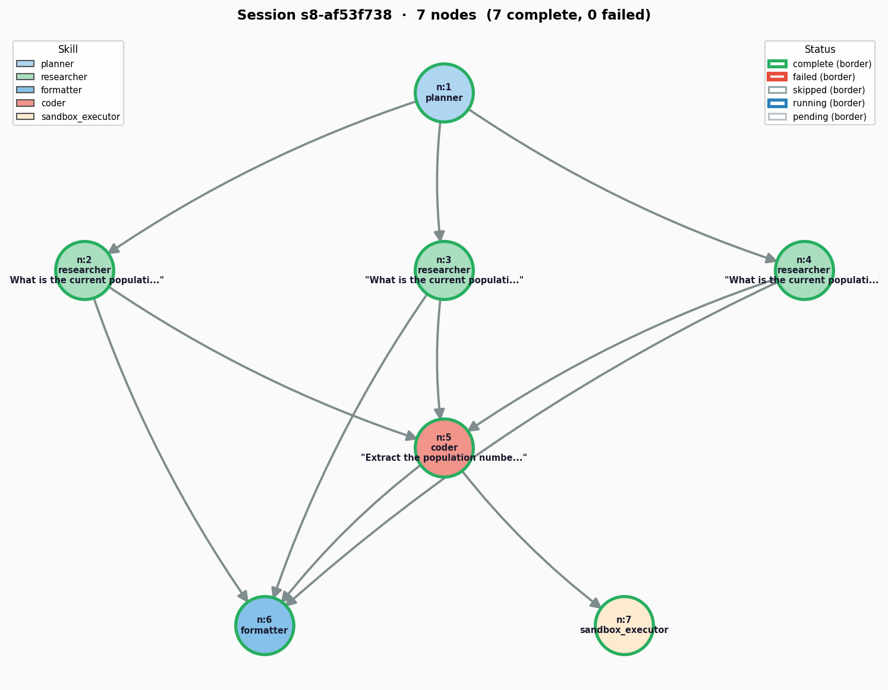

# Dynamic DAG-Based Agent Orchestrator

A multi-agent, growing-graph (DAG) orchestrator built on NetworkX and asyncio. Features parallel node execution, Critic verification loops, real-time Planner-guided recovery splicing, and a subprocess sandbox for executing code generated by the Coder skill.

---

## 📺 Demo Video

[](https://www.youtube.com/watch?v=I2n8HoV_tpk)


---

## 📋 Verification Logs

### Question 1.1: Hello Check

* **Query:** `Say hello.`
<details>
<summary><b>Toggle Run Logs</b></summary>

```text
Query > Say hello.

══════════════════════════════════════════════════════════════════════════════
session s8-44f7ef25  ─  query: Say hello.
══════════════════════════════════════════════════════════════════════════════
[n:1] planner            complete (3.9s)
[n:2] formatter          complete (3.9s)

══════════════════════════════════════════════════════════════════════════════
FINAL: Hello! How can I help you today?
══════════════════════════════════════════════════════════════════════════════

```
</details>

---

### Question 1.2: Claude Shannon Search
* **Query:** `Fetch https://en.wikipedia.org/wiki/Claude_Shannon and tell me his birth date, death date, and three key contributions to information theory.`
<details>
<summary><b>Toggle Run Logs</b></summary>

```text
Query > Fetch https://en.wikipedia.org/wiki/Claude_Shannon and tell me his birth date, death date, and three key contributions to information theory.

══════════════════════════════════════════════════════════════════════════════
session s8-8297f24e  ─  query: Fetch https://en.wikipedia.org/wiki/Claude_Shannon and tell me his birth date, death date, and three key contributions to information theory.
══════════════════════════════════════════════════════════════════════════════
[n:1] planner            complete (4.2s)
[06/06/26 07:03:22] INFO     Processing request of type CallToolRequest                                                server.py:727
[INIT].... → Crawl4AI 0.8.6 
[FETCH]... ↓ https://en.wikipedia.org/wiki/Claude_Shannon                                                         | ✓ | ⏱: 1.66s 
[SCRAPE].. ◆ https://en.wikipedia.org/wiki/Claude_Shannon                                                         | ✓ | ⏱: 0.23s 
[COMPLETE] ● https://en.wikipedia.org/wiki/Claude_Shannon                                                         | ✓ | ⏱: 1.91s 
[06/06/26 07:03:26] INFO     Processing request of type ListToolsRequest                                               server.py:727
[06/06/26 07:03:27] INFO     Processing request of type CallToolRequest                                                server.py:727
[INIT].... → Crawl4AI 0.8.6 
[FETCH]... ↓ https://en.wikipedia.org/wiki/Claude_Shannon#Information_theory                                      | ✓ | ⏱: 1.41s 
[SCRAPE].. ◆ https://en.wikipedia.org/wiki/Claude_Shannon#Information_theory                                      | ✓ | ⏱: 0.23s 
[COMPLETE] ● https://en.wikipedia.org/wiki/Claude_Shannon#Information_theory                                      | ✓ | ⏱: 1.65s 
[06/06/26 07:03:31] INFO     Processing request of type CallToolRequest                                                server.py:727
[n:2] researcher         complete (18.1s)
[n:3] distiller          complete (3.1s)
[n:4] formatter          complete (3.9s)

══════════════════════════════════════════════════════════════════════════════
FINAL: Claude Shannon was born on April 30, 1916, and passed away on February 24, 2001. His three key contributions to information theory include: 1) Establishing the bit as the fundamental unit of information and measure of entropy; 2) Developing the mathematical model for communication in his 1948 paper; and 3) Demonstrating that all information could be represented and transmitted using binary digits.
══════════════════════════════════════════════════════════════════════════════

```
</details>

---

### Question 1.3: Parallel Population Comparison
* **Query:** `Find the populations of London, Paris, Berlin and tell me which two are closest in size.`
<details>
<summary><b>Toggle Run Logs</b></summary>

```text
Query > Find the populations of London, Paris, Berlin and tell me which two are closest in size.

══════════════════════════════════════════════════════════════════════════════
session s8-bdf14fa3  ─  query: Find the populations of London, Paris, Berlin and tell me which two are closest in size.
══════════════════════════════════════════════════════════════════════════════
[memory.read] 2 hit(s) visible to every skill this run
[n:1] planner            complete (4.8s)
[06/06/26 07:04:00] INFO     Processing request of type CallToolRequest                                                  server.py:727
[06/06/26 07:04:01] INFO     response:                                                                                      lib.rs:444
                             https://en.wikipedia.org/w/api.php?action=opensearch&profile=fuzzy&limit=1&search=current%20po           
                             pulation%20of%20Paris%202024%202025 200                                                                  
                    INFO     response:                                                                                      lib.rs:444
                             https://grokipedia.com/api/typeahead?query=current+population+of+Paris+2024+2025&limit=1 200             
[06/06/26 07:04:02] INFO     response:                                                                                      lib.rs:444
                             https://yandex.com/search/site/?text=current+population+of+Paris+2024+2025&web=1&searchid=6702           
                             464 200                                                                                                  
                    INFO     Processing request of type ListToolsRequest                                                 server.py:727
[06/06/26 07:04:04] INFO     Processing request of type CallToolRequest                                                  server.py:727
                    INFO     response:                                                                                      lib.rs:444
                             https://en.wikipedia.org/w/api.php?action=opensearch&profile=fuzzy&limit=1&search=current%20po           
                             pulation%20of%20London%202024%202025 200                                                                 
[06/06/26 07:04:05] INFO     response:                                                                                      lib.rs:444
                             https://grokipedia.com/api/typeahead?query=current+population+of+London+2024+2025&limit=1 200            
[06/06/26 07:04:06] INFO     response:                                                                                      lib.rs:444
                             https://yandex.com/search/site/?text=current+population+of+London+2024+2025&web=1&searchid=734           
                             8609 200                                                                                                 
                    INFO     Processing request of type ListToolsRequest                                                 server.py:727
[06/06/26 07:04:08] INFO     Processing request of type CallToolRequest                                                  server.py:727
[06/06/26 07:04:09] INFO     response:                                                                                      lib.rs:444
                             https://en.wikipedia.org/w/api.php?action=opensearch&profile=fuzzy&limit=1&search=current%20po           
                             pulation%20of%20Berlin%202024%202025 200                                                                 
                    INFO     response:                                                                                      lib.rs:444
                             https://grokipedia.com/api/typeahead?query=current+population+of+Berlin+2024+2025&limit=1 200            
                    INFO     response: https://www.startpage.com/ 200                                                       lib.rs:444
[06/06/26 07:04:10] INFO     response: https://www.startpage.com/sp/search 200                                              lib.rs:444
                    INFO     Processing request of type ListToolsRequest                                                 server.py:727
[06/06/26 07:04:12] INFO     Processing request of type CallToolRequest                                                  server.py:727
[INIT].... → Crawl4AI 0.8.6 
[FETCH]... ↓ https://worldpopulationreview.com/cities/france/paris                                                | ✓ | ⏱: 1.53s 
[SCRAPE].. ◆ https://worldpopulationreview.com/cities/france/paris                                                | ✓ | ⏱: 0.10s 
[COMPLETE] ● https://worldpopulationreview.com/cities/france/paris                                                | ✓ | ⏱: 1.65s 
[06/06/26 07:04:16] INFO     Processing request of type CallToolRequest                                                  server.py:727
[INIT].... → Crawl4AI 0.8.6 
[FETCH]... ↓ https://en.wikipedia.org/wiki/London                                                                 | ✓ | ⏱: 1.62s 
[SCRAPE].. ◆ https://en.wikipedia.org/wiki/London                                                                 | ✓ | ⏱: 0.56s 
[COMPLETE] ● https://en.wikipedia.org/wiki/London                                                                 | ✓ | ⏱: 2.22s 
[06/06/26 07:04:20] INFO     Processing request of type CallToolRequest                                                  server.py:727
[INIT].... → Crawl4AI 0.8.6 
[FETCH]... ↓ https://en.wikipedia.org/wiki/Berlin                                                                 | ✓ | ⏱: 1.54s 
[SCRAPE].. ◆ https://en.wikipedia.org/wiki/Berlin                                                                 | ✓ | ⏱: 0.59s 
[COMPLETE] ● https://en.wikipedia.org/wiki/Berlin                                                                 | ✓ | ⏱: 2.15s 
[n:2] researcher         complete (36.3s)
[n:3] researcher         complete (28.0s)
[n:4] researcher         complete (32.4s)
[n:5] coder              complete (3.8s)
[n:6] formatter          complete (3.6s)
[n:7] sandbox_executor   complete (0.1s)

══════════════════════════════════════════════════════════════════════════════
FINAL: The estimated populations for the three cities are as follows: London has approximately 9.15 million residents, Berlin has approximately 3.8 million, and Paris has approximately 2.06 million. Based on these figures, the two cities closest in size are Berlin and Paris, with a population difference of approximately 1.74 million.
══════════════════════════════════════════════════════════════════════════════


Query > q
Exiting interactive loop.
(eagv3-s8)  ~/Personal/Learnings/EAG3/session8/code/agent/ [main] python timeline.py s8-bdf14fa3            

Timeline for Session: s8-bdf14fa3
Node   Skill              Start (rel)  Elapsed    Finish (rel)
──────────────────────────────────────────────────────────────
n:1    planner                0.00 s      4.84 s        4.84 s
n:2    researcher             4.85 s     36.32 s       41.17 s
n:4    researcher             8.82 s     32.36 s       41.17 s
n:3    researcher            13.16 s     28.01 s       41.17 s
n:5    coder                 41.18 s      3.82 s       45.00 s
n:6    formatter             45.01 s      3.57 s       48.58 s
n:7    sandbox_executor      48.53 s      0.05 s       48.58 s
──────────────────────────────────────────────────────────────
Wall-clock end-to-end:       48.58 s
Sum-of-elapsed (serial):     108.98 s
Parallel speedup ratio:        2.24x
```
</details>



---

### Question 1.4: Fallback for Invalid Paths
* **Query:** `Read /nonexistent/path.txt and tell me what's in it.`
<details>
<summary><b>Toggle Run Logs</b></summary>

```text
Query > Read /nonexistent/path.txt and tell me what's in it.

══════════════════════════════════════════════════════════════════════════════
session s8-f196483f  ─  query: Read /nonexistent/path.txt and tell me what's in it.
══════════════════════════════════════════════════════════════════════════════
[memory.read] 3 hit(s) visible to every skill this run
[n:1] planner            complete (4.1s)
[n:2] formatter          complete (3.8s)

══════════════════════════════════════════════════════════════════════════════
FINAL: I am unable to read the file at /nonexistent/path.txt because the specified path does not exist.
══════════════════════════════════════════════════════════════════════════════


```
</details>

---

### Question 1.5: SIGKILL Resume Verification
* **Query:** For Lagos, Cairo, and Kinshasa, find current populations and growth rates and tell me which is growing fastest.
<details>
<summary><b>Toggle Run Logs</b></summary>

```text
Query > For Lagos, Cairo, and Kinshasa, find current populations and growth rates and tell me which is growing fastest.

══════════════════════════════════════════════════════════════════════════════
session s8-d878d68c  ─  query: For Lagos, Cairo, and Kinshasa, find current populations and growth rates and tell me which is growing fastest.
══════════════════════════════════════════════════════════════════════════════
[memory.read] 3 hit(s) visible to every skill this run
[n:1] planner            complete (4.5s)
[06/06/26 07:06:03] INFO     Processing request of type CallToolRequest                                                  server.py:727
                    INFO     response:                                                                                      lib.rs:444
                             https://en.wikipedia.org/w/api.php?action=opensearch&profile=fuzzy&limit=1&search=current%20po           
                             pulation%20and%20annual%20growth%20rate%20of%20Cairo%202024%202025 200                                   
                    INFO     response:                                                                                      lib.rs:444
                             https://grokipedia.com/api/typeahead?query=current+population+and+annual+growth+rate+of+Cairo+           
                             2024+2025&limit=1 200                                                                                    
[06/06/26 07:06:04] INFO     response:                                                                                      lib.rs:444
                             https://yandex.com/search/site/?text=current+population+and+annual+growth+rate+of+Cairo+2024+2           
                             025&web=1&searchid=1617204 200                                                                           
                    INFO     Processing request of type ListToolsRequest                                                 server.py:727
[06/06/26 07:06:07] INFO     Processing request of type CallToolRequest                                                  server.py:727
                    INFO     response:                                                                                      lib.rs:444
                             https://en.wikipedia.org/w/api.php?action=opensearch&profile=fuzzy&limit=1&search=current%20po           
                             pulation%20and%20annual%20growth%20rate%20of%20Lagos%202024%202025 200                                   
                    INFO     response:                                                                                      lib.rs:444
                             https://grokipedia.com/api/typeahead?query=current+population+and+annual+growth+rate+of+Lagos+           
                             2024+2025&limit=1 200                                                                                    
[06/06/26 07:06:08] INFO     response:                                                                                      lib.rs:444
                             https://www.google.com/search?q=current+population+and+annual+growth+rate+of+Lagos+2024+2025&f           
                             ilter=1&start=0&hl=en-US&lr=lang_en&cr=countryUS 200                                                     
[06/06/26 07:06:10] INFO     response:                                                                                      lib.rs:444
                             https://search.brave.com/search?q=current+population+and+annual+growth+rate+of+Lagos+2024+2025           
                             &source=web 429                                                                                          
                    INFO     response:                                                                                      lib.rs:444
                             https://www.mojeek.com/search?q=current+population+and+annual+growth+rate+of+Lagos+2024+2025             
                             403                                                                                                      
                    INFO     HTTP Request: POST https://html.duckduckgo.com/html/ "HTTP/2 202 Accepted"                _client.py:1025
[06/06/26 07:06:11] INFO     response: https://www.startpage.com/ 200                                                       lib.rs:444
[06/06/26 07:06:11] INFO     Processing request of type CallToolRequest                                                  server.py:727
                    INFO     response: https://www.startpage.com/sp/search 200                                              lib.rs:444
                    INFO     Processing request of type ListToolsRequest                                                 server.py:727
                    INFO     response:                                                                                      lib.rs:444
                             https://en.wikipedia.org/w/api.php?action=opensearch&profile=fuzzy&limit=1&search=current%20po           
                             pulation%20and%20annual%20growth%20rate%20of%20Kinshasa%202024%202025 200                                
[06/06/26 07:06:12] INFO     response:                                                                                      lib.rs:444
                             https://grokipedia.com/api/typeahead?query=current+population+and+annual+growth+rate+of+Kinsha           
                             sa+2024+2025&limit=1 200                                                                                 
                    INFO     HTTP Request: POST https://html.duckduckgo.com/html/ "HTTP/2 202 Accepted"                _client.py:1025
                    INFO     response:                                                                                      lib.rs:444
                             https://search.yahoo.com/search;_ylt=a4cbSRQ_Ohbp9I7_i-_BaQKh;_ylu=B_aglgemBEJl7a4ulKCVesm13it           
                             A28Dgn_8xcNanZ3wLQuA?p=current+population+and+annual+growth+rate+of+Kinshasa+2024+2025 200               
[06/06/26 07:06:13] INFO     response: https://www.startpage.com/ 200                                                       lib.rs:444
[06/06/26 07:06:14] INFO     response: https://www.startpage.com/sp/search 200                                              lib.rs:444
                    INFO     Processing request of type ListToolsRequest                                                 server.py:727
[06/06/26 07:06:15] INFO     Processing request of type CallToolRequest                                                  server.py:727
[INIT].... → Crawl4AI 0.8.6 
[FETCH]... ↓ https://worldpopulationreview.com/cities/egypt/cairo                                                 | ✓ | ⏱: 1.64s 
[SCRAPE].. ◆ https://worldpopulationreview.com/cities/egypt/cairo                                                 | ✓ | ⏱: 0.04s 
[COMPLETE] ● https://worldpopulationreview.com/cities/egypt/cairo                                                 | ✓ | ⏱: 1.69s 
[06/06/26 07:06:19] INFO     Processing request of type CallToolRequest                                                  server.py:727
[INIT].... → Crawl4AI 0.8.6 
[FETCH]... ↓ https://www.macrotrends.net/global-metrics/cities/22007/lagos/population                             | ✓ | ⏱: 2.43s 
[SCRAPE].. ◆ https://www.macrotrends.net/global-metrics/cities/22007/lagos/population                             | ✓ | ⏱: 0.01s 
[COMPLETE] ● https://www.macrotrends.net/global-metrics/cities/22007/lagos/population                             | ✓ | ⏱: 2.46s 
[06/06/26 07:06:23] INFO     Processing request of type CallToolRequest                                                  server.py:727
^C^C^CTraceback (most recent call last):
    raise KeyboardInterrupt()
KeyboardInterrupt
```
</details>

<details>
<summary><b>Toggle Run Logs</b></summary>

```text
python flow.py --resume s8-d878d68c           

══════════════════════════════════════════════════════════════════════════════
session s8-d878d68c  ─  query: For Lagos, Cairo, and Kinshasa, find current populations and growth rates and tell me which is growing fastest.
══════════════════════════════════════════════════════════════════════════════
[memory.read] 4 hit(s) visible to every skill this run
[06/06/26 07:07:35] INFO     Processing request of type CallToolRequest                                                  server.py:727
[06/06/26 07:07:36] INFO     response:                                                                                      lib.rs:444
                             https://en.wikipedia.org/w/api.php?action=opensearch&profile=fuzzy&limit=1&search=current%20po           
                             pulation%20and%20annual%20growth%20rate%20of%20Kinshasa%202024%202025 200                                
                    INFO     response:                                                                                      lib.rs:444
                             https://grokipedia.com/api/typeahead?query=current+population+and+annual+growth+rate+of+Kinsha           
                             sa+2024+2025&limit=1 200                                                                                 
                    INFO     HTTP Request: POST https://html.duckduckgo.com/html/ "HTTP/2 202 Accepted"                _client.py:1025
                    INFO     response: https://www.startpage.com/ 200                                                       lib.rs:444
[06/06/26 07:07:37] INFO     response: https://www.startpage.com/sp/search 200                                              lib.rs:444
                    INFO     Processing request of type ListToolsRequest                                                 server.py:727
[06/06/26 07:07:39] INFO     Processing request of type CallToolRequest                                                  server.py:727
[06/06/26 07:07:40] INFO     response:                                                                                      lib.rs:444
                             https://en.wikipedia.org/w/api.php?action=opensearch&profile=fuzzy&limit=1&search=current%20po           
                             pulation%20and%20annual%20growth%20rate%20of%20Lagos%202024%202025 200                                   
                    INFO     response:                                                                                      lib.rs:444
                             https://grokipedia.com/api/typeahead?query=current+population+and+annual+growth+rate+of+Lagos+           
                             2024+2025&limit=1 200                                                                                    
                    INFO     response:                                                                                      lib.rs:444
                             https://www.mojeek.com/search?q=current+population+and+annual+growth+rate+of+Lagos+2024+2025             
                             403                                                                                                      
[06/06/26 07:07:41] INFO     response: https://www.startpage.com/ 200                                                       lib.rs:444
                    INFO     response: https://www.startpage.com/sp/search 200                                              lib.rs:444
[06/06/26 07:07:42] INFO     Processing request of type ListToolsRequest                                                 server.py:727
[06/06/26 07:07:43] INFO     Processing request of type CallToolRequest                                                  server.py:727
[06/06/26 07:07:44] INFO     response:                                                                                      lib.rs:444
                             https://en.wikipedia.org/w/api.php?action=opensearch&profile=fuzzy&limit=1&search=current%20po           
                             pulation%20and%20annual%20growth%20rate%20of%20Cairo%202024%202025 200                                   
                    INFO     response:                                                                                      lib.rs:444
                             https://grokipedia.com/api/typeahead?query=current+population+and+annual+growth+rate+of+Cairo+           
                             2024+2025&limit=1 200                                                                                    
                    INFO     response:                                                                                      lib.rs:444
                             https://yandex.com/search/site/?text=current+population+and+annual+growth+rate+of+Cairo+2024+2           
                             025&web=1&searchid=5172223 200                                                                           
                    INFO     Processing request of type ListToolsRequest                                                 server.py:727
[06/06/26 07:07:47] INFO     Processing request of type CallToolRequest                                                  server.py:727
[INIT].... → Crawl4AI 0.8.6 
[FETCH]... ↓ https://worldpopulationreview.com/cities/egypt/cairo                                                 | ✓ | ⏱: 1.74s 
[SCRAPE].. ◆ https://worldpopulationreview.com/cities/egypt/cairo                                                 | ✓ | ⏱: 0.03s 
[COMPLETE] ● https://worldpopulationreview.com/cities/egypt/cairo                                                 | ✓ | ⏱: 1.78s 
[06/06/26 07:07:51] INFO     Processing request of type CallToolRequest                                                  server.py:727
[INIT].... → Crawl4AI 0.8.6 
[FETCH]... ↓ https://www.macrotrends.net/global-metrics/cities/20853/kinshasa/population                          | ✓ | ⏱: 2.48s 
[SCRAPE].. ◆ https://www.macrotrends.net/global-metrics/cities/20853/kinshasa/population                          | ✓ | ⏱: 0.01s 
[COMPLETE] ● https://www.macrotrends.net/global-metrics/cities/20853/kinshasa/population                          | ✓ | ⏱: 2.50s 
[06/06/26 07:07:55] INFO     Processing request of type CallToolRequest                                                  server.py:727
[INIT].... → Crawl4AI 0.8.6 
[FETCH]... ↓ https://www.macrotrends.net/global-metrics/cities/22007/lagos/population                             | ✓ | ⏱: 2.22s 
[SCRAPE].. ◆ https://www.macrotrends.net/global-metrics/cities/22007/lagos/population                             | ✓ | ⏱: 0.01s 
[COMPLETE] ● https://www.macrotrends.net/global-metrics/cities/22007/lagos/population                             | ✓ | ⏱: 2.24s 
[n:2] researcher         complete (33.0s)
[n:3] researcher         complete (28.6s)
[n:4] researcher         complete (36.8s)
[n:5] coder              complete (3.8s)
[n:6] formatter          complete (3.9s)
[n:7] sandbox_executor   complete (0.1s)

══════════════════════════════════════════════════════════════════════════════
FINAL: As of 2026, here are the population and annual growth rate estimates for the three cities:

1. Lagos: Approximately 17.8 million residents with an annual growth rate of 3.78%.
2. Cairo: Approximately 10.12 million residents (city proper) with an annual growth rate of 1.07%.
3. Kinshasa: Approximately 18.55 million residents with an annual growth rate of 4.36%.

Kinshasa is the fastest-growing city among the three, with an annual growth rate of 4.36%.
══════════════════════════════════════════════════════════════════════════════

```
</details>

---

### Question 2: Parallel Fan-out Concurrency Validation

* **Query:** `What are the approximate diameters of Mars, Venus, and Neptune? Which two planets are closest in size, and by how much?`
<details>
<summary><b>Toggle Run Logs</b></summary>

```text
Query > What are the approximate diameters of Mars, Venus, and Neptune? Which two planets are closest in size, and by how much?

══════════════════════════════════════════════════════════════════════════════
session s8-204cece2  ─  query: What are the approximate diameters of Mars, Venus, and Neptune? Which two planets are closest in size, and by how much?
══════════════════════════════════════════════════════════════════════════════
[memory.read] 5 hit(s) visible to every skill this run
[n:1] planner            complete (1.7s)
[06/06/26 07:09:01] INFO     Processing request of type CallToolRequest                                                  server.py:727
                    INFO     response:                                                                                      lib.rs:444
                             https://en.wikipedia.org/w/api.php?action=opensearch&profile=fuzzy&limit=1&search=approximate%           
                             20diameter%20of%20Neptune%20in%20kilometers 200                                                          
                    INFO     response:                                                                                      lib.rs:444
                             https://grokipedia.com/api/typeahead?query=approximate+diameter+of+Neptune+in+kilometers&limit           
                             =1 200                                                                                                   
[06/06/26 07:09:02] INFO     response: https://www.startpage.com/ 200                                                       lib.rs:444
                    INFO     response: https://www.startpage.com/sp/search 200                                              lib.rs:444
                    INFO     Processing request of type ListToolsRequest                                                 server.py:727
[06/06/26 07:09:05] INFO     Processing request of type CallToolRequest                                                  server.py:727
                    INFO     response:                                                                                      lib.rs:444
                             https://en.wikipedia.org/w/api.php?action=opensearch&profile=fuzzy&limit=1&search=diameter%20o           
                             f%20Venus%20in%20kilometers 200                                                                          
                    INFO     response: https://grokipedia.com/api/typeahead?query=diameter+of+Venus+in+kilometers&limit=1   lib.rs:444
                             200                                                                                                      
[06/06/26 07:09:07] INFO     response: https://www.mojeek.com/search?q=diameter+of+Venus+in+kilometers 200                  lib.rs:444
                    INFO     Processing request of type ListToolsRequest                                                 server.py:727
[06/06/26 07:09:09] INFO     Processing request of type CallToolRequest                                                  server.py:727
                    INFO     response:                                                                                      lib.rs:444
                             https://en.wikipedia.org/w/api.php?action=opensearch&profile=fuzzy&limit=1&search=approximate%           
                             20diameter%20of%20Mars%20in%20kilometers 200                                                             
[06/06/26 07:09:10] INFO     response:                                                                                      lib.rs:444
                             https://grokipedia.com/api/typeahead?query=approximate+diameter+of+Mars+in+kilometers&limit=1            
                             200                                                                                                      
                    INFO     response: https://www.startpage.com/ 200                                                       lib.rs:444
[06/06/26 07:09:11] INFO     response: https://www.startpage.com/sp/search 200                                              lib.rs:444
                    INFO     Processing request of type ListToolsRequest                                                 server.py:727
[06/06/26 07:09:13] INFO     Processing request of type CallToolRequest                                                  server.py:727
[INIT].... → Crawl4AI 0.8.6 
[FETCH]... ↓ https://www.space.com/18530-how-big-is-venus.html                                                    | ✓ | ⏱: 1.85s 
[SCRAPE].. ◆ https://www.space.com/18530-how-big-is-venus.html                                                    | ✓ | ⏱: 0.10s 
[COMPLETE] ● https://www.space.com/18530-how-big-is-venus.html                                                    | ✓ | ⏱: 1.98s 
[06/06/26 07:09:17] INFO     Processing request of type CallToolRequest                                                  server.py:727
[INIT].... → Crawl4AI 0.8.6 
[FETCH]... ↓ https://science.nasa.gov/mars/facts/                                                                 | ✓ | ⏱: 1.81s 
[SCRAPE].. ◆ https://science.nasa.gov/mars/facts/                                                                 | ✓ | ⏱: 0.08s 
[COMPLETE] ● https://science.nasa.gov/mars/facts/                                                                 | ✓ | ⏱: 1.90s 
[06/06/26 07:09:21] INFO     Processing request of type CallToolRequest                                                  server.py:727
[INIT].... → Crawl4AI 0.8.6 
[FETCH]... ↓ https://science.nasa.gov/neptune/neptune-facts/                                                      | ✓ | ⏱: 1.68s 
[SCRAPE].. ◆ https://science.nasa.gov/neptune/neptune-facts/                                                      | ✓ | ⏱: 0.06s 
[COMPLETE] ● https://science.nasa.gov/neptune/neptune-facts/                                                      | ✓ | ⏱: 1.76s 
[06/06/26 07:09:25] INFO     Processing request of type CallToolRequest                                                  server.py:727
[INIT].... → Crawl4AI 0.8.6 
[06/06/26 07:09:29] INFO     Processing request of type CallToolRequest                                                  server.py:727
[FETCH]... ↓ https://www.dimensionsguide.com/apparent-diameter-venus/                                             | ✓ | ⏱: 3.60s 
[SCRAPE].. ◆ https://www.dimensionsguide.com/apparent-diameter-venus/                                             | ✓ | ⏱: 0.03s 
[COMPLETE] ● https://www.dimensionsguide.com/apparent-diameter-venus/                                             | ✓ | ⏱: 3.65s 
[INIT].... → Crawl4AI 0.8.6 
[FETCH]... ↓ https://www.britannica.com/place/Mars-planet                                                         | ✓ | ⏱: 2.97s 
[SCRAPE].. ◆ https://www.britannica.com/place/Mars-planet                                                         | ✓ | ⏱: 0.04s 
[COMPLETE] ● https://www.britannica.com/place/Mars-planet                                                         | ✓ | ⏱: 3.03s 
[06/06/26 07:09:33] INFO     Processing request of type CallToolRequest                                                  server.py:727
[INIT].... → Crawl4AI 0.8.6 
[FETCH]... ↓ https://en.wikipedia.org/wiki/Neptune                                                                | ✓ | ⏱: 1.67s 
[SCRAPE].. ◆ https://en.wikipedia.org/wiki/Neptune                                                                | ✓ | ⏱: 0.31s 
[COMPLETE] ● https://en.wikipedia.org/wiki/Neptune                                                                | ✓ | ⏱: 2.00s 
[n:2] researcher         complete (48.6s)
[n:3] researcher         complete (44.1s)
[n:4] researcher         complete (40.0s)
[n:5] coder              complete (3.6s)
[n:6] formatter          complete (3.7s)
[n:7] sandbox_executor   complete (0.1s)

══════════════════════════════════════════════════════════════════════════════
FINAL: The approximate equatorial diameters of the three planets are as follows:

* Mars: 6,794 km
* Venus: 12,104 km
* Neptune: 49,528 km

Of these three, Mars and Venus are the closest in size, with a difference of 5,310 kilometers.
══════════════════════════════════════════════════════════════════════════════


Query > q
Exiting interactive loop.
(eagv3-s8)  ~/Personal/Learnings/EAG3/session8/code/agent/ [main] python timeline.py s8-204cece2             

Timeline for Session: s8-204cece2
Node   Skill              Start (rel)  Elapsed    Finish (rel)
──────────────────────────────────────────────────────────────
n:1    planner                0.00 s      1.73 s        1.73 s
n:2    researcher             1.74 s     48.59 s       50.33 s
n:3    researcher             6.23 s     44.10 s       50.33 s
n:4    researcher            10.29 s     40.05 s       50.33 s
n:5    coder                 50.34 s      3.62 s       53.95 s
n:6    formatter             53.96 s      3.68 s       57.64 s
n:7    sandbox_executor      57.59 s      0.06 s       57.64 s
──────────────────────────────────────────────────────────────
Wall-clock end-to-end:       57.64 s
Sum-of-elapsed (serial):     141.83 s
Parallel speedup ratio:        2.46x
```
</details>

---

### Question 3: Critic Verdict & Planner Recovery Loop


* **Query:** `Research what Retrieval-Augmented Generation (RAG) is and summarise the answer as a numbered list with exactly 3 points, each point a single sentence under 20 words.`

<details>
<summary><b>Toggle Success Run Logs</b></summary>

```text
Query > Research what Retrieval-Augmented Generation (RAG) is and summarise the answer as a numbered list with exactly 3 points, each point a single sentence under 20 words.

══════════════════════════════════════════════════════════════════════════════
session s8-ee729e67  ─  query: Research what Retrieval-Augmented Generation (RAG) is and summarise the answer as a numbered list with exactly 3 points, each point a single sentence under 20 words.
══════════════════════════════════════════════════════════════════════════════
[n:1] planner            complete (4.6s)
[06/06/26 11:43:39] INFO     Processing request of type CallToolRequest                                                   server.py:727
[06/06/26 11:43:40] INFO     response:                                                                                       lib.rs:444
                             https://en.wikipedia.org/w/api.php?action=opensearch&profile=fuzzy&limit=1&search=what%20is%20R           
                             etrieval-Augmented%20Generation%20%28RAG%29 200                                                           
                    INFO     response:                                                                                       lib.rs:444
                             https://grokipedia.com/api/typeahead?query=what+is+Retrieval-Augmented+Generation+%28RAG%29&lim           
                             it=1 200                                                                                                  
[06/06/26 11:43:41] INFO     response:                                                                                       lib.rs:444
                             https://search.yahoo.com/search;_ylt=6_IsjAprpyTgxG2cLdeRUSKT;_ylu=IUPxWCTHj5nljQ2s0HNRMSEGn1nJ           
                             wxTQh5TH6rUB1Z6kU1E?p=what+is+Retrieval-Augmented+Generation+%28RAG%29 200                                
[06/06/26 11:43:42] INFO     response: https://www.startpage.com/ 200                                                        lib.rs:444
[06/06/26 11:43:43] INFO     response: https://www.startpage.com/sp/search 200                                               lib.rs:444
                    INFO     Processing request of type ListToolsRequest                                                  server.py:727
[06/06/26 11:43:44] INFO     Processing request of type CallToolRequest                                                   server.py:727
[INIT].... → Crawl4AI 0.8.6 
[FETCH]... ↓ https://aws.amazon.com/what-is/retrieval-augmented-generation/                                       | ✓ | ⏱: 18.80s 
[SCRAPE].. ◆ https://aws.amazon.com/what-is/retrieval-augmented-generation/                                       | ✓ | ⏱: 9.22s 
[COMPLETE] ● https://aws.amazon.com/what-is/retrieval-augmented-generation/                                       | ✓ | ⏱: 32.37s 
[n:2] researcher         complete (54.3s)
[n:3] summariser         complete (3.2s)
[n:4] critic             complete (1.4s)
[n:5] formatter          complete (2.5s)

══════════════════════════════════════════════════════════════════════════════
FINAL: 1. RAG combines large language models with external data retrieval to improve response accuracy. 2. It fetches relevant documents from a database before generating a tailored answer for the user. 3. This process reduces hallucinations by grounding model outputs in verified, up-to-date information sources.
══════════════════════════════════════════════════════════════════════════════

```
</details>

* **Query:** `Fetch the primary fields of research for Claude Shannon, Alan Turing, and Ada Lovelace from Wikipedia. For each person extract exactly these three fields: full_name, birth_date, death_date. Then write a single paragraph describing how their contributions are connected — the paragraph must be strictly under 300 characters. Fail the answer if it exceeds that limit.`

<details>
<summary><b>Toggle Failure Run Logs</b></summary>

```text
Query > Fetch the primary fields of research for Claude Shannon, Alan Turing, and Ada Lovelace from Wikipedia. For each person extract exactly these three fields: full_name, birth_date, death_date. Then write a single paragraph describing how their contributions are connected — the paragraph must be strictly under 300 characters. Fail the answer if it exceeds that limit.

══════════════════════════════════════════════════════════════════════════════
session s8-9717965c  ─  query: Fetch the primary fields of research for Claude Shannon, Alan Turing, and Ada Lovelace from Wikipedia. For each person extract exactly these three fields: full_name, birth_date, death_date. Then write a single paragraph describing how their contributions are connected — the paragraph must be strictly under 300 characters. Fail the answer if it exceeds that limit.
══════════════════════════════════════════════════════════════════════════════
[memory.read] 2 hit(s) visible to every skill this run
[n:1] planner            complete (5.5s)
[06/06/26 11:49:59] INFO     Processing request of type CallToolRequest                                                   server.py:727
[06/06/26 11:50:01] INFO     response:                                                                                       lib.rs:444
                             https://en.wikipedia.org/w/api.php?action=opensearch&profile=fuzzy&limit=1&search=Ada%20Lovelac           
                             e%20Wikipedia 200                                                                                         
                    INFO     response: https://grokipedia.com/api/typeahead?query=Ada+Lovelace+Wikipedia&limit=1 200         lib.rs:444
[06/06/26 11:50:02] INFO     response: https://www.mojeek.com/search?q=Ada+Lovelace+Wikipedia 200                            lib.rs:444
                    INFO     Processing request of type ListToolsRequest                                                  server.py:727
[06/06/26 11:50:03] INFO     Processing request of type CallToolRequest                                                   server.py:727
[06/06/26 11:50:04] INFO     response:                                                                                       lib.rs:444
                             https://en.wikipedia.org/w/api.php?action=opensearch&profile=fuzzy&limit=1&search=Alan%20Turing           
                             %20Wikipedia 200                                                                                          
                    INFO     response: https://grokipedia.com/api/typeahead?query=Alan+Turing+Wikipedia&limit=1 200          lib.rs:444
[06/06/26 11:50:05] INFO     response:                                                                                       lib.rs:444
                             https://search.yahoo.com/search;_ylt=qnegastPqZjRV427ccwJJ8kS;_ylu=P2u5IgcxxUcoxIO4dozIffL139ye           
                             NrOhq2GryxZLD-6fY9E?p=Alan+Turing+Wikipedia 200                                                           
[06/06/26 11:50:06] INFO     response: https://search.brave.com/search?q=Alan+Turing+Wikipedia&source=web 200                lib.rs:444
                    INFO     Processing request of type ListToolsRequest                                                  server.py:727
[06/06/26 11:50:07] INFO     Processing request of type CallToolRequest                                                   server.py:727
[06/06/26 11:50:08] INFO     response:                                                                                       lib.rs:444
                             https://en.wikipedia.org/w/api.php?action=opensearch&profile=fuzzy&limit=1&search=Claude%20Shan           
                             non%20Wikipedia 200                                                                                       
[06/06/26 11:50:09] INFO     response: https://grokipedia.com/api/typeahead?query=Claude+Shannon+Wikipedia&limit=1 200       lib.rs:444
                    INFO     HTTP Request: POST https://html.duckduckgo.com/html/ "HTTP/2 202 Accepted"                 _client.py:1025
[06/06/26 11:50:10] INFO     response: https://search.brave.com/search?q=Claude+Shannon+Wikipedia&source=web 200             lib.rs:444
                    INFO     Processing request of type ListToolsRequest                                                  server.py:727
[06/06/26 11:50:12] INFO     Processing request of type CallToolRequest                                                   server.py:727
[06/06/26 11:50:16] INFO     Processing request of type CallToolRequest                                                   server.py:727
[INIT].... → Crawl4AI 0.8.6 
[06/06/26 11:50:20] INFO     Processing request of type CallToolRequest                                                   server.py:727
[INIT].... → Crawl4AI 0.8.6 
[FETCH]... ↓ https://en.wikipedia.org/wiki/Ada_Lovelace                                                           | ✓ | ⏱: 8.28s 
[SCRAPE].. ◆ https://en.wikipedia.org/wiki/Ada_Lovelace                                                           | ✓ | ⏱: 2.68s 
[COMPLETE] ● https://en.wikipedia.org/wiki/Ada_Lovelace                                                           | ✓ | ⏱: 11.27s 
[FETCH]... ↓ https://en.wikipedia.org/wiki/Alan_Turing                                                            | ✓ | ⏱: 6.31s 
[INIT].... → Crawl4AI 0.8.6 
[SCRAPE].. ◆ https://en.wikipedia.org/wiki/Alan_Turing                                                            | ✓ | ⏱: 3.35s 
[COMPLETE] ● https://en.wikipedia.org/wiki/Alan_Turing                                                            | ✓ | ⏱: 10.60s 
[FETCH]... ↓ https://en.wikipedia.org/wiki/Claude_Shannon                                                         | ✓ | ⏱: 5.01s 
[SCRAPE].. ◆ https://en.wikipedia.org/wiki/Claude_Shannon                                                         | ✓ | ⏱: 1.86s 
[COMPLETE] ● https://en.wikipedia.org/wiki/Claude_Shannon                                                         | ✓ | ⏱: 7.03s 
[n:2] researcher         complete (54.8s)
[n:3] researcher         complete (50.2s)
[n:4] researcher         complete (46.9s)
[n:5] distiller          complete (2.9s)
[n:6] summariser         complete (4.7s)
[n:7] critic             complete (1.6s)
  ↪ critic-fail recovery: planner node n:9 for n:6
[n:8] formatter          complete (3.2s)
[n:9] planner            complete (4.9s)
[06/06/26 11:51:09] INFO     Processing request of type CallToolRequest                                                   server.py:727
[06/06/26 11:51:10] INFO     response:                                                                                       lib.rs:444
                             https://en.wikipedia.org/w/api.php?action=opensearch&profile=fuzzy&limit=1&search=Claude%20Shan           
                             non%20Wikipedia 200                                                                                       
[06/06/26 11:51:11] INFO     response: https://grokipedia.com/api/typeahead?query=Claude+Shannon+Wikipedia&limit=1 200       lib.rs:444
                    INFO     response:                                                                                       lib.rs:444
                             https://www.google.com/search?q=Claude+Shannon+Wikipedia&filter=1&start=0&hl=en-US&lr=lang_en&c           
                             r=countryUS 200                                                                                           
[06/06/26 11:51:12] INFO     response: https://www.startpage.com/sp/captcha 200                                              lib.rs:444
                    INFO     response: https://www.startpage.com/sp/captcha 200                                              lib.rs:444
[06/06/26 11:51:13] INFO     HTTP Request: POST https://html.duckduckgo.com/html/ "HTTP/2 202 Accepted"                 _client.py:1025
                    INFO     response: https://yandex.com/search/site/?text=Claude+Shannon+Wikipedia&web=1&searchid=8657943  lib.rs:444
                             200                                                                                                       
                    INFO     Processing request of type ListToolsRequest                                                  server.py:727
[06/06/26 11:51:13] INFO     Processing request of type CallToolRequest                                                   server.py:727
[06/06/26 11:51:15] INFO     response:                                                                                       lib.rs:444
                             https://en.wikipedia.org/w/api.php?action=opensearch&profile=fuzzy&limit=1&search=Alan%20Turing           
                             %20Wikipedia 200                                                                                          
                    INFO     response: https://grokipedia.com/api/typeahead?query=Alan+Turing+Wikipedia&limit=1 200          lib.rs:444
                    INFO     response:                                                                                       lib.rs:444
                             https://www.google.com/search?q=Alan+Turing+Wikipedia&filter=1&start=0&hl=en-US&lr=lang_en&cr=c           
                             ountryUS 200                                                                                              
[06/06/26 11:51:16] INFO     response: https://yandex.com/search/site/?text=Alan+Turing+Wikipedia&web=1&searchid=8944650 200 lib.rs:444
                    INFO     Processing request of type ListToolsRequest                                                  server.py:727
[06/06/26 11:51:18] INFO     Processing request of type CallToolRequest                                                   server.py:727
                    INFO     response:                                                                                       lib.rs:444
                             https://en.wikipedia.org/w/api.php?action=opensearch&profile=fuzzy&limit=1&search=Ada%20Lovelac           
                             e%20Wikipedia 200                                                                                         
                    INFO     response: https://grokipedia.com/api/typeahead?query=Ada+Lovelace+Wikipedia&limit=1 200         lib.rs:444
[06/06/26 11:51:19] INFO     response:                                                                                       lib.rs:444
                             https://search.yahoo.com/search;_ylt=y81Rg6_brQDBqLF0y5scyowD;_ylu=qIjpZopdvsFE60_e82xEbM3eOrqv           
                             dkewtdkwVl4utrSZmqI?p=Ada+Lovelace+Wikipedia 200                                                          
[06/06/26 11:51:20] INFO     Processing request of type ListToolsRequest                                                  server.py:727
[06/06/26 11:51:21] INFO     Processing request of type CallToolRequest                                                   server.py:727
[06/06/26 11:51:26] INFO     Processing request of type CallToolRequest                                                   server.py:727
[INIT].... → Crawl4AI 0.8.6 
[06/06/26 11:51:30] INFO     Processing request of type CallToolRequest                                                   server.py:727
[FETCH]... ↓ https://en.wikipedia.org/wiki/Alan_Turing                                                            | ✓ | ⏱: 5.13s 
[SCRAPE].. ◆ https://en.wikipedia.org/wiki/Alan_Turing                                                            | ✓ | ⏱: 3.43s 
[COMPLETE] ● https://en.wikipedia.org/wiki/Alan_Turing                                                            | ✓ | ⏱: 8.87s 
[INIT].... → Crawl4AI 0.8.6 
[06/06/26 11:51:39] INFO     Processing request of type CallToolRequest                                                   server.py:727
[FETCH]... ↓ https://en.wikipedia.org/wiki/Claude_Shannon                                                         | ✓ | ⏱: 4.96s 
[INIT].... → Crawl4AI 0.8.6 
[SCRAPE].. ◆ https://en.wikipedia.org/wiki/Claude_Shannon                                                         | ✓ | ⏱: 3.48s 
[COMPLETE] ● https://en.wikipedia.org/wiki/Claude_Shannon                                                         | ✓ | ⏱: 8.70s 
[INIT].... → Crawl4AI 0.8.6 
[FETCH]... ↓ https://en.wikipedia.org/wiki/Ada_Lovelace                                                           | ✓ | ⏱: 6.27s 
[06/06/26 11:51:52] INFO     Processing request of type CallToolRequest                                                   server.py:727
[SCRAPE].. ◆ https://en.wikipedia.org/wiki/Ada_Lovelace                                                           | ✓ | ⏱: 2.46s 
[COMPLETE] ● https://en.wikipedia.org/wiki/Ada_Lovelace                                                           | ✓ | ⏱: 8.96s 
[FETCH]... ↓ https://simple.wikipedia.org/wiki/Alan_Turing                                                        | ✓ | ⏱: 6.13s 
[SCRAPE].. ◆ https://simple.wikipedia.org/wiki/Alan_Turing                                                        | ✓ | ⏱: 0.45s 
[COMPLETE] ● https://simple.wikipedia.org/wiki/Alan_Turing                                                        | ✓ | ⏱: 6.67s 
[INIT].... → Crawl4AI 0.8.6 
[FETCH]... ↓ https://en.wikipedia.org/api/rest_v1/page/summary/Claude_Shannon                                     | ✓ | ⏱: 2.38s 
[SCRAPE].. ◆ https://en.wikipedia.org/api/rest_v1/page/summary/Claude_Shannon                                     | ✓ | ⏱: 0.01s 
[COMPLETE] ● https://en.wikipedia.org/api/rest_v1/page/summary/Claude_Shannon                                     | ✓ | ⏱: 2.41s 
[06/06/26 11:52:04] INFO     Processing request of type CallToolRequest                                                   server.py:727
[n:10] researcher         complete (64.8s)
[n:11] researcher         complete (56.8s)
[n:12] researcher         complete (52.7s)
[n:13] distiller          complete (2.7s)
[n:14] critic             complete (0.7s)
  ↪ critic-fail recovery: planner node n:16 for n:13
[n:16] planner            complete (4.0s)
[06/06/26 11:52:22] INFO     Processing request of type CallToolRequest                                                   server.py:727
[06/06/26 11:52:24] INFO     response:                                                                                       lib.rs:444
                             https://en.wikipedia.org/w/api.php?action=opensearch&profile=fuzzy&limit=1&search=Alan%20Turing           
                             %20Wikipedia 200                                                                                          
                    INFO     response: https://grokipedia.com/api/typeahead?query=Alan+Turing+Wikipedia&limit=1 200          lib.rs:444
[06/06/26 11:52:25] INFO     response: https://yandex.com/search/site/?text=Alan+Turing+Wikipedia&web=1&searchid=8873847 200 lib.rs:444
                    INFO     Processing request of type ListToolsRequest                                                  server.py:727
[06/06/26 11:52:26] INFO     Processing request of type CallToolRequest                                                   server.py:727
[06/06/26 11:52:27] INFO     response:                                                                                       lib.rs:444
                             https://en.wikipedia.org/w/api.php?action=opensearch&profile=fuzzy&limit=1&search=Claude%20Shan           
                             non%20Wikipedia 200                                                                                       
[06/06/26 11:52:28] INFO     response: https://grokipedia.com/api/typeahead?query=Claude+Shannon+Wikipedia&limit=1 200       lib.rs:444
                    INFO     response: https://search.brave.com/search?q=Claude+Shannon+Wikipedia&source=web 200             lib.rs:444
                    INFO     Processing request of type ListToolsRequest                                                  server.py:727
[06/06/26 11:52:30] INFO     Processing request of type CallToolRequest                                                   server.py:727
[06/06/26 11:52:31] INFO     response:                                                                                       lib.rs:444
                             https://en.wikipedia.org/w/api.php?action=opensearch&profile=fuzzy&limit=1&search=Ada%20Lovelac           
                             e%20Wikipedia 200                                                                                         
                    INFO     response: https://grokipedia.com/api/typeahead?query=Ada+Lovelace+Wikipedia&limit=1 200         lib.rs:444
                    INFO     response:                                                                                       lib.rs:444
                             https://www.google.com/search?q=Ada+Lovelace+Wikipedia&filter=1&start=0&hl=en-US&lr=lang_en&cr=           
                             countryUS 200                                                                                             
[06/06/26 11:52:32] INFO     response: https://www.mojeek.com/search?q=Ada+Lovelace+Wikipedia 200                            lib.rs:444
                    INFO     Processing request of type ListToolsRequest                                                  server.py:727
[06/06/26 11:52:34] INFO     Processing request of type CallToolRequest                                                   server.py:727
[06/06/26 11:52:38] INFO     Processing request of type CallToolRequest                                                   server.py:727
[INIT].... → Crawl4AI 0.8.6 
[06/06/26 11:52:43] INFO     Processing request of type CallToolRequest                                                   server.py:727
[FETCH]... ↓ https://en.wikipedia.org/wiki/Alan_Turing                                                            | ✓ | ⏱: 5.56s 
[INIT].... → Crawl4AI 0.8.6 
[SCRAPE].. ◆ https://en.wikipedia.org/wiki/Alan_Turing                                                            | ✓ | ⏱: 4.13s 
[COMPLETE] ● https://en.wikipedia.org/wiki/Alan_Turing                                                            | ✓ | ⏱: 9.90s 
[FETCH]... ↓ https://en.wikipedia.org/wiki/Claude_Shannon                                                         | ✓ | ⏱: 4.89s 
[INIT].... → Crawl4AI 0.8.6 
[SCRAPE].. ◆ https://en.wikipedia.org/wiki/Claude_Shannon                                                         | ✓ | ⏱: 3.14s 
[COMPLETE] ● https://en.wikipedia.org/wiki/Claude_Shannon                                                         | ✓ | ⏱: 8.16s 
[FETCH]... ↓ https://en.wikipedia.org/wiki/Ada_Lovelace                                                           | ✓ | ⏱: 4.54s 
[SCRAPE].. ◆ https://en.wikipedia.org/wiki/Ada_Lovelace                                                           | ✓ | ⏱: 3.03s 
[COMPLETE] ● https://en.wikipedia.org/wiki/Ada_Lovelace                                                           | ✓ | ⏱: 7.87s 
[06/06/26 11:53:04] INFO     Processing request of type CallToolRequest                                                   server.py:727
[INIT].... → Crawl4AI 0.8.6 
[FETCH]... ↓ https://en.wikipedia.org/api/rest_v1/page/summary/Alan_Turing                                        | ✓ | ⏱: 2.76s 
[SCRAPE].. ◆ https://en.wikipedia.org/api/rest_v1/page/summary/Alan_Turing                                        | ✓ | ⏱: 0.07s 
[COMPLETE] ● https://en.wikipedia.org/api/rest_v1/page/summary/Alan_Turing                                        | ✓ | ⏱: 2.88s 
[06/06/26 11:53:13] INFO     Processing request of type CallToolRequest                                                   server.py:727
[n:17] researcher         complete (43.9s)
[n:18] researcher         complete (60.4s)
[n:19] researcher         complete (51.6s)
[n:20] distiller          complete (3.7s)
[n:21] summariser         complete (4.0s)
[n:22] critic             complete (1.5s)
[n:23] formatter          complete (3.7s)

══════════════════════════════════════════════════════════════════════════════
FINAL: 1. Claude Elwood Shannon: April 30, 1916 - February 24, 2001. 2. Alan Mathison Turing: June 23, 1912 - June 7, 1954. 3. Augusta Ada King, Countess of Lovelace: 10 December 1815 - 27 November 1852. Lovelace pioneered algorithms, Turing formalized computing, and Shannon linked logic to circuits.
══════════════════════════════════════════════════════════════════════════════

```
</details>

---

### Question 4: Coder & Sandbox Execution

* **Query:** `What is the compound interest of 1000 rupees at 5% annual interest over 20 years and tell me what is the final balance. `
<details>
<summary><b>Toggle Run Logs</b></summary>

```text

Query > What is the compound interest of 1000 rupees at 5% annual interest over 20 years and tell me what is the final balance. 

══════════════════════════════════════════════════════════════════════════════
session s8-4b9e03a1  ─  query: What is the compound interest of 1000 rupees at 5% annual interest over 20 years and tell me what is the final balance.
══════════════════════════════════════════════════════════════════════════════
[n:1] planner            complete (1.1s)
[n:2] coder              complete (4.3s)
[n:3] formatter          complete (3.6s)
[n:4] sandbox_executor   complete (0.1s)

══════════════════════════════════════════════════════════════════════════════
FINAL: For a principal amount of 1,000 rupees invested at an annual interest rate of 5% over 20 years, the final balance is 2,653.30 rupees. The total compound interest earned over this period is 1,653.30 rupees.
══════════════════════════════════════════════════════════════════════════════


```
</details>

---

### Question 5: Custom Skill Integration (`linkedin_writer`)

* **Query:** `Research recent breakthroughs in quantisation techniques for large language models and write a LinkedIn post about it.`
<details>
<summary><b>Toggle Run Logs</b></summary>

```text

Query > Research recent breakthroughs in quantisation techniques for large language models and write a LinkedIn post about it.

══════════════════════════════════════════════════════════════════════════════
session s8-fc46bac5  ─  query: Research recent breakthroughs in quantisation techniques for large language models and write a LinkedIn post about it.
══════════════════════════════════════════════════════════════════════════════
[memory.read] 2 hit(s) visible to every skill this run
[n:1] planner            complete (4.4s)
[06/06/26 11:47:27] INFO     Processing request of type CallToolRequest                                                   server.py:727
[06/06/26 11:47:28] INFO     response:                                                                                       lib.rs:444
                             https://en.wikipedia.org/w/api.php?action=opensearch&profile=fuzzy&limit=1&search=recent%20brea           
                             kthroughs%20in%20LLM%20quantization%20techniques%202024%202025%20QLoRA%20AWQ%20HQQ%20BitNet 200           
[06/06/26 11:47:30] INFO     response:                                                                                       lib.rs:444
                             https://grokipedia.com/api/typeahead?query=recent+breakthroughs+in+LLM+quantization+techniques+           
                             2024+2025+QLoRA+AWQ+HQQ+BitNet&limit=1 200                                                                
                    INFO     HTTP Request: POST https://html.duckduckgo.com/html/ "HTTP/2 202 Accepted"                 _client.py:1025
[06/06/26 11:47:31] INFO     response: https://www.startpage.com/ 200                                                        lib.rs:444
                    INFO     response: https://www.startpage.com/sp/search 200                                               lib.rs:444
                    INFO     Processing request of type ListToolsRequest                                                  server.py:727
[06/06/26 11:47:32] INFO     Processing request of type CallToolRequest                                                   server.py:727
[INIT].... → Crawl4AI 0.8.6 
[FETCH]... ↓ https://arxiv.org/html/2409.16694v3                                                                  | ✓ | ⏱: 4.59s 
[SCRAPE].. ◆ https://arxiv.org/html/2409.16694v3                                                                  | ✓ | ⏱: 2.06s 
[COMPLETE] ● https://arxiv.org/html/2409.16694v3                                                                  | ✓ | ⏱: 6.72s 
[n:2] researcher         complete (24.9s)
[n:3] linkedin_writer    complete (2.7s)
[n:4] formatter          complete (3.8s)

══════════════════════════════════════════════════════════════════════════════
FINAL: Quantization is no longer just about shrinking model size; it’s about making production-grade LLMs viable on consumer hardware.

We’ve moved past simple post-training compression. Techniques like QLoRA now allow for memory-efficient fine-tuning by backpropagating through frozen 4-bit models, while AWQ maintains performance by intelligently protecting salient weights from quantization error.

For faster deployment, HQQ provides a calibration-free path that cuts overhead without sacrificing precision. Meanwhile, the frontier is pushing toward 1.58-bit models like BitNet, which aim to replace cos
══════════════════════════════════════════════════════════════════════════════


Query > q
Exiting interactive loop.
(eagv3-s8)  ~/Personal/Learnings/EAG3/session8/code/agent/ [main] python replay.py s8-fc46bac5           
session  s8-fc46bac5
query    Research recent breakthroughs in quantisation techniques for large language models and write a LinkedIn post about it.
nodes    4

press enter to advance, p to expand prompt, o to expand output, q to quit

node 1 / 4
  agent      planner
  status     complete
  elapsed    4.4s
  provider   gemini
  retries    0
  inputs     USER_QUERY
  output     {"rationale": "Research recent LLM quantization breakthroughs and then draft a technical LinkedIn post based on the findings.", "nodes": [{"skill": "researcher", "inputs": ["USER_QUERY"], "metadata": {"label": "research", "question": "What are the most significant recent breakthroughs in quantization techniques for large language models (e.g., QLoRA, AWQ, HQQ, BitNet)?"}}, {"skill": "linkedin_writer", "inputs": ["n:research"], "metadata": {"label": "draft", "question": "Write a LinkedIn post in …
> 

node 2 / 4
  agent      researcher
  status     complete
  elapsed    24.9s
  provider   gemini
  retries    0
  inputs     USER_QUERY
  output     {"question": "What are the most significant recent breakthroughs in quantization techniques for large language models (e.g., QLoRA, AWQ, HQQ, BitNet)?", "sources": [{"url": "https://arxiv.org/html/2409.16694v3", "title": "A Survey of Low-bit Large Language Models: Basics, Systems, and Algorithms"}, {"url": "https://ojs.aaai.org/index.php/AAAI/article/view/37989/41951", "title": "Bi-VLM: Binary Post-Training Quantization for Vision-Language Models"}], "findings": "Recent breakthroughs in Large La…
> 

node 3 / 4
  agent      linkedin_writer
  status     complete
  elapsed    2.7s
  provider   gemini
  retries    0
  inputs     n:2
  output     {"post": "Quantization is no longer just about shrinking model size; it’s about making production-grade LLMs viable on consumer hardware.\n\nWe’ve moved past simple post-training compression. Techniques like QLoRA now allow for memory-efficient fine-tuning by backpropagating through frozen 4-bit models, while AWQ maintains performance by intelligently protecting salient weights from quantization error.\n\nFor faster deployment, HQQ provides a calibration-free path that cuts overhead without sacr…
> o

──────────────────────────────────────────────────────────────────────────────
{
  "post": "Quantization is no longer just about shrinking model size; it’s about making production-grade LLMs viable on consumer hardware.\n\nWe’ve moved past simple post-training compression. Techniques like QLoRA now allow for memory-efficient fine-tuning by backpropagating through frozen 4-bit models, while AWQ maintains performance by intelligently protecting salient weights from quantization error.\n\nFor faster deployment, HQQ provides a calibration-free path that cuts overhead without sacrificing precision. Meanwhile, the frontier is pushing toward 1.58-bit models like BitNet, which aim to replace costly matrix multiplications with simple addition operations.\n\nThe real breakthrough is the shift toward systems-level optimization. It’s not just the math—it’s how these compressed weights and KV-caches interact with GPU kernels to actually reduce latency.\n\nAre you seeing consistent performance gains with these low-bit methods in your production pipelines, or are the trade-offs still too steep for your use cases?",
  "hashtags": [
    "#MLEngineering",
    "#LLM",
    "#Quantization",
    "#AIInfrastructure"
  ],
  "char_count": 1058
}
──────────────────────────────────────────────────────────────────────────────

node 3 / 4
  agent      linkedin_writer
  status     complete
  elapsed    2.7s
  provider   gemini
  retries    0
  inputs     n:2
  output     {"post": "Quantization is no longer just about shrinking model size; it’s about making production-grade LLMs viable on consumer hardware.\n\nWe’ve moved past simple post-training compression. Techniques like QLoRA now allow for memory-efficient fine-tuning by backpropagating through frozen 4-bit models, while AWQ maintains performance by intelligently protecting salient weights from quantization error.\n\nFor faster deployment, HQQ provides a calibration-free path that cuts overhead without sacr…
> 

node 4 / 4
  agent      formatter
  status     complete
  elapsed    3.8s
  provider   gemini
  retries    0
  inputs     USER_QUERY, n:2, n:3
  output     {"final_answer": "Quantization is no longer just about shrinking model size; it’s about making production-grade LLMs viable on consumer hardware.\n\nWe’ve moved past simple post-training compression. Techniques like QLoRA now allow for memory-efficient fine-tuning by backpropagating through frozen 4-bit models, while AWQ maintains performance by intelligently protecting salient weights from quantization error.\n\nFor faster deployment, HQQ provides a calibration-free path that cuts overhead with…
> o

──────────────────────────────────────────────────────────────────────────────
{
  "final_answer": "Quantization is no longer just about shrinking model size; it’s about making production-grade LLMs viable on consumer hardware.\n\nWe’ve moved past simple post-training compression. Techniques like QLoRA now allow for memory-efficient fine-tuning by backpropagating through frozen 4-bit models, while AWQ maintains performance by intelligently protecting salient weights from quantization error.\n\nFor faster deployment, HQQ provides a calibration-free path that cuts overhead without sacrificing precision. Meanwhile, the frontier is pushing toward 1.58-bit models like BitNet, which aim to replace costly matrix multiplications with simple addition operations.\n\nThe real breakthrough is the shift toward systems-level optimization. It’s not just the math—it’s how these compressed weights and KV-caches interact with GPU kernels to actually reduce latency.\n\nAre you seeing consistent performance gains with these low-bit methods in your production pipelines, or are the trade-offs still too steep for your use cases?\n\n#MLEngineering #LLM #Quantization #AIInfrastructure"
}
──────────────────────────────────────────────────────────────────────────────

node 4 / 4
  agent      formatter
  status     complete
  elapsed    3.8s
  provider   gemini
  retries    0
  inputs     USER_QUERY, n:2, n:3
  output     {"final_answer": "Quantization is no longer just about shrinking model size; it’s about making production-grade LLMs viable on consumer hardware.\n\nWe’ve moved past simple post-training compression. Techniques like QLoRA now allow for memory-efficient fine-tuning by backpropagating through frozen 4-bit models, while AWQ maintains performance by intelligently protecting salient weights from quantization error.\n\nFor faster deployment, HQQ provides a calibration-free path that cuts overhead with…
> 

(end of session)

```
</details>
